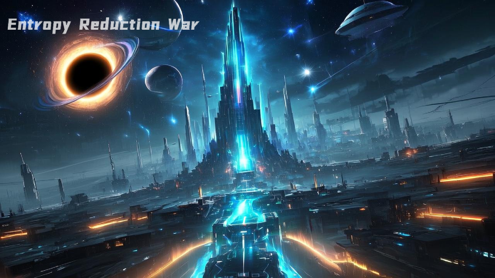

<p align="center">
  
</p>
<p align="center">
  <a href="https://opensource.org/licenses/MIT"></a>
  <a href="https://qm.qq.com/q/iifNs5qukg"></a>
</p>

# 熵减战争 (Entropy Reduction War)

> 对抗宇宙熵增的科幻放置游戏

## 游戏简介

《熵减战争》是一款以“熵减”为核心主题的科幻放置类策略游戏。你将领导文明，从微观的原子排序、分子冷却，到宏观的恒星熄灭、黑洞解压，最终实现能量物质化和宇宙单一化，对抗宇宙的熵增法则，追求最低熵的终极秩序。游戏融合了资源管理、科技树、建筑系统、阶段推进、成就系统、宇宙探索等多种玩法，兼具科幻世界观与策略深度。

## 游戏特色

- **熵减进程**：手动推进，从原子排序到宇宙单一化，体验逐步逆转熵增的成就感。
- **科技与建筑**：解锁并升级与熵减阶段对应的科技和建筑，提升资源产出与熵减效率。
- **资源管理**：能量、物质、暗物质、反物质、纳米材料、量子比特等多种资源协同发展。
- **宇宙探索系统**：消耗探测器派遣探索，抽取高方差资源池、稀有掉落，收集碎片/日志合成稀有奖励，体验未知与收集乐趣。
- **毕业进度可视化**：科技、阶段、建筑、熵减完成度四维度毕业进度一目了然，目标清晰。
- **黑暗森林法则**：坐标暴露过高会触发降维打击，需谨慎发展。部分科技和建筑可以降低暴露值或提供防护。
- **高自由度成长**：多线目标、分支结局、策略分配，支持多种成长与毕业路径。
- **开发者友好**：内置 GM 面板，支持资源、建筑、科技、阶段等一键调整，便于测试与二创。

## 游戏玩法

1. **手动熵减**：点击“执行熵减”按钮，消耗资源推进当前熵减阶段。
2. **建造建筑**：建造和升级当前阶段的建筑，提升资源产出和熵减效率。
3. **解锁科技**：解锁与当前阶段相关的科技，获得新能力和更高效率。
4. **宇宙探索**：制造探测器，派遣探索，抽取资源池与稀有掉落，收集碎片/日志合成稀有奖励。
5. **毕业进度追踪**：毕业进度卡片实时展示四大维度进度，目标明确。
6. **管理威胁**：注意坐标暴露和三体偏差，防止文明被降维打击。

## 主要系统

- **熵减阶段**：原子排序 → 分子冷却 → 恒星熄灭 → 黑洞解压 → 能量物质化 → 宇宙单一化
- **资源类型**：能量、物质、暗物质、反物质、纳米材料、量子比特、文明基因、探测器、碎片/日志等
- **科技与建筑**：每个阶段有专属科技和建筑，支持熵减进程
- **宇宙探索**：高方差掉落池、稀有掉落、碎片/日志收集与合成
- **毕业进度**：科技、阶段、建筑、熵减完成度四维度进度条
- **GM 面板**：开发/测试专用，支持一键调整所有核心数据

## 技术栈

- [Vue 3](https://vuejs.org) + [Pinia](https://pinia.vuejs.org) 状态管理
- [Element Plus](https://element-plus.org) UI 组件库
- [Vite](https://vitejs.dev) 前端构建工具

## 本地开发与运行

```bash
# 安装依赖
npm install

# 启动开发服务器
npm run dev

# 构建生产版本
npm run build
```

## 参与贡献

欢迎提交 issue、PR 或建议！  
开源地址：[https://github.com/setube/idle-negentropy-war](https://github.com/setube/idle-negentropy-war)

## License

[MIT](LICENSE)

> 本项目灵感来源于物理学熵减、三体、黑暗森林等科幻设定，欢迎交流与二创！
